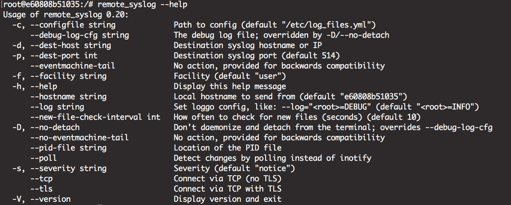

> https://github.com/papertrail/remote_syslog2

# Test

1. 更新 config.yml 中的 `host`、`port`
2. `docker-compose up -d`
3. 在 fakeLog 中的 log, 更新內容
4. 至 `https://papertrailapp.com/systems/papertrail-test/events` 查看 log
    - papertrail 帳號，請跟管理者申請

# Usage
1. 更新 config.yml ... 完整的設定檔可參考 config.yml.example
2. 啟動 docker-compose 即可